# 10. Full product architecture

The complete MarginMint product as specified in [`MarginMint.md`](../../MarginMint.md): every module, data model, pipeline and job, and how they fit together. It shows **the whole product, not just today's build**.

> **Legend:** ✅ built and tested · 🧪 built, not yet run against a live account · 🔜 planned (in the spec, not built)
>
> Today's as-built detail is in docs [01](01-system-overview.md)–[09](09-target-architecture.md). This page is the map everything is heading towards.

---

## 10.1 The whole product on one page



Diagram source (Mermaid): edit here, then run <code>npm run docs:diagrams</code>

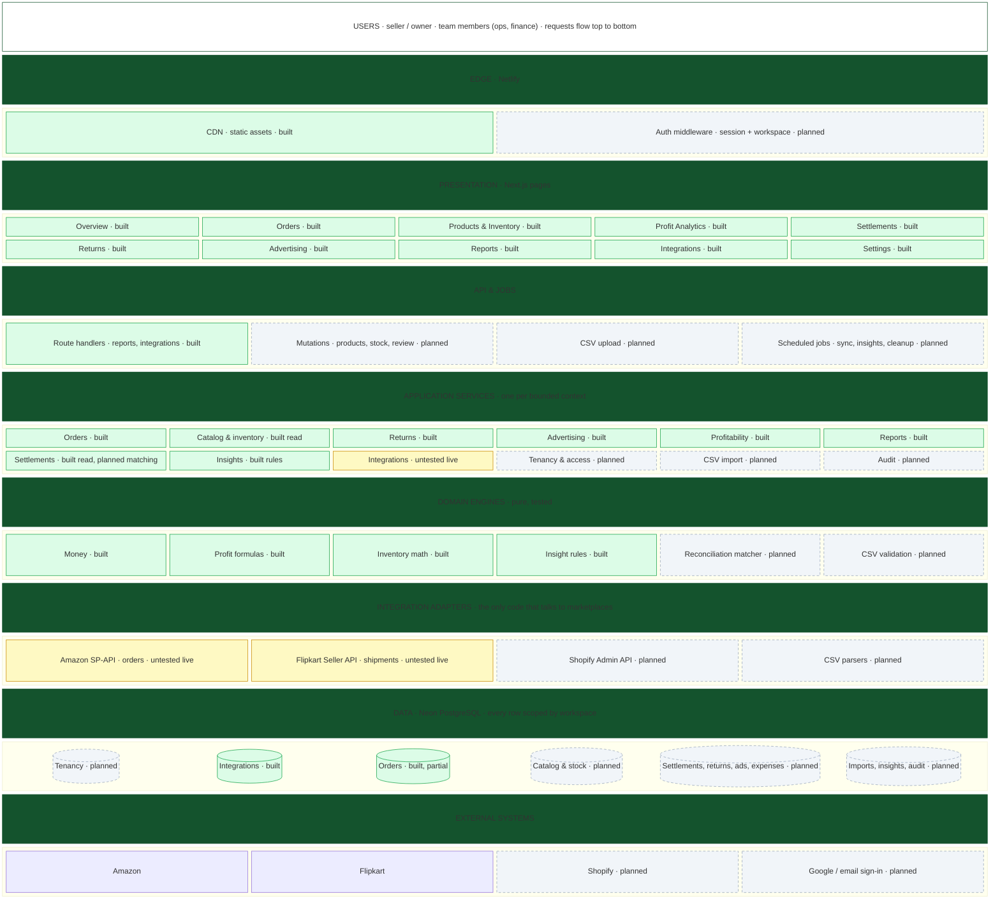
```mermaid
block-beta
  columns 1
  users["USERS · seller / owner · team members (ops, finance) · requests flow top to bottom"]
  edgeT["EDGE · Netlify"]
  block:edge
    columns 2
    cdn["CDN · static assets · built"]
    authmw["Auth middleware · session + workspace · planned"]
  end
  pagesT["PRESENTATION · Next.js pages"]
  block:pages
    columns 5
    p1["Overview · built"] p2["Orders · built"] p3["Products & Inventory · built"] p4["Profit Analytics · built"] p5["Settlements · built"]
    p6["Returns · built"] p7["Advertising · built"] p8["Reports · built"] p9["Integrations · built"] p10["Settings · built"]
  end
  apiT["API & JOBS"]
  block:api
    columns 4
    routes["Route handlers · reports, integrations · built"]
    actions["Mutations · products, stock, review · planned"]
    uploads["CSV upload · planned"]
    jobs["Scheduled jobs · sync, insights, cleanup · planned"]
  end
  svcT["APPLICATION SERVICES · one per bounded context"]
  block:services
    columns 6
    sOrd["Orders · built"] sCat["Catalog & inventory · built read"] sRet["Returns · built"] sAds["Advertising · built"] sProf["Profitability · built"] sRep["Reports · built"]
    sSet["Settlements · built read, planned matching"] sIns["Insights · built rules"] sInt["Integrations · untested live"] sTen["Tenancy & access · planned"] sImp["CSV import · planned"] sAud["Audit · planned"]
  end
  domT["DOMAIN ENGINES · pure, tested"]
  block:domain
    columns 6
    dMoney["Money · built"] dFin["Profit formulas · built"] dInv["Inventory math · built"] dRules["Insight rules · built"] dRec["Reconciliation matcher · planned"] dCsv["CSV validation · planned"]
  end
  adT["INTEGRATION ADAPTERS · the only code that talks to marketplaces"]
  block:adapters
    columns 4
    aAmz["Amazon SP-API · orders · untested live"] aFk["Flipkart Seller API · shipments · untested live"] aShop["Shopify Admin API · planned"] aCsv["CSV parsers · planned"]
  end
  dataT["DATA · Neon PostgreSQL · every row scoped by workspace"]
  block:data
    columns 6
    dbTen[("Tenancy · planned")] dbInt[("Integrations · built")] dbOrd[("Orders · built, partial")] dbCat[("Catalog & stock · planned")] dbFin[("Settlements, returns, ads, expenses · planned")] dbOps[("Imports, insights, audit · planned")]
  end
  extT["EXTERNAL SYSTEMS"]
  block:ext
    columns 4
    amz["Amazon"] fk["Flipkart"] shop["Shopify · planned"] idp["Google / email sign-in · planned"]
  end

  classDef header fill:#14532D,stroke:#14532D,color:#ffffff
  classDef built fill:#DCFCE7,stroke:#16A34A,color:#111827
  classDef live fill:#FEF9C3,stroke:#CA8A04,color:#111827
  classDef planned fill:#F1F5F9,stroke:#94A3B8,color:#475569,stroke-dasharray:5 4
  classDef people fill:#FFFFFF,stroke:#14532D,color:#111827
  class edgeT,pagesT,apiT,svcT,domT,adT,dataT,extT header
  class cdn,p1,p2,p3,p4,p5,p6,p7,p8,p9,p10,routes,sOrd,sCat,sRet,sAds,sProf,sRep,sSet,sIns,dMoney,dFin,dInv,dRules,dbInt,dbOrd built
  class sInt,aAmz,aFk live
  class authmw,actions,uploads,jobs,sTen,sImp,sAud,dRec,dCsv,aShop,aCsv,dbTen,dbCat,dbFin,dbOps,shop,idp planned
  class users people
```

**How to read it:** each dark bar is a layer; requests flow top to bottom. Box colour and text both show status: green = built, yellow = built but untested against a live account, grey dashed = planned. Pages call services; services use pure domain engines for every calculation; adapters are the only code that talks to marketplaces; everything is stored in PostgreSQL, scoped by workspace.

---

## 10.2 Bounded contexts (modules)

Each context owns its data, services and UI. Contexts talk through service functions, never by reaching into each other's tables.

| Context | Responsibility | Owns (data) | Status | Code (today / proposed) |
|---------|---------------|-------------|--------|-------------------------|
| **Tenancy & access** | Users, workspaces, members, roles, sessions | User, Workspace, WorkspaceMember | 🔜 (Workspace table ✅) | `services/workspace.ts` → `features/tenancy/` |
| **Integrations** | Marketplace OAuth, sync engine, connection status | MarketplaceAccount (today `MarketplaceConnection`), OAuthState, SyncRun | ✅ 🧪 | `integrations/`, `services/integrations/` |
| **CSV import** | Upload, map, validate, dedupe, commit, summary | CsvImportJob | 🔜 | `features/imports/` |
| **Catalog & inventory** | Products, listings per channel, stock balances, movements, reorder points | Product, ProductMarketplaceListing, InventoryBalance, InventoryMovement | ✅ read (demo) · 🔜 write + DB | `services/inventory.ts`, `products.ts` |
| **Orders** | Orders, items, per-order costs, statuses | Order (today `ExternalOrder`), OrderItem, OrderCost | ✅ list/detail · 🔜 edits | `services/orders.ts`, `services/integrations/synced-orders.ts` |
| **Profitability** | Product, channel and workspace profit from one ledger | (derived) | ✅ demo · 🔜 on DB | `services/ledger.ts`, `profitability.ts`, `domain/finance.ts` |
| **Settlements** | Statements, transactions, matching, adjustments, review | SettlementBatch, SettlementTransaction, SettlementMatch, SettlementAdjustment | ✅ read (demo) · 🔜 engine + review | `services/settlements.ts` → `domain/reconciliation.ts` |
| **Returns** | Return records, recovery, loss, rates | ReturnRecord | ✅ read (demo) | `services/returns.ts` |
| **Advertising** | Campaigns, daily metrics, ROAS/ACOS | AdvertisingCampaign, AdvertisingDailyMetric | ✅ read (demo) · 🔜 import | `services/advertising.ts` |
| **Expenses** | Operating costs, shared overhead | Expense | ✅ read (demo) · 🔜 entry | `services/ledger.ts` |
| **Insights** | Deterministic rules, lifecycle (read/resolved), dedupe | Insight | ✅ rules · 🔜 persistence | `domain/insights.ts` |
| **Reports** | P&L, products, channels, stock, settlements, returns, ads, orders → CSV | (derived) | ✅ | `services/reports.ts`, `lib/csv` |
| **Audit** | Who changed what, before/after, reason | AuditLog | 🔜 | `features/audit/` |

---

## 10.3 Full data model (all 22 spec models)

Split into three views for readability. `ws` = every table carries `workspaceId` with workspace-scoped unique keys. Money columns are `DECIMAL(14,2)` + `currency`.

### A. Tenancy, integrations and imports



Diagram source (Mermaid): edit here, then run <code>npm run docs:diagrams</code>

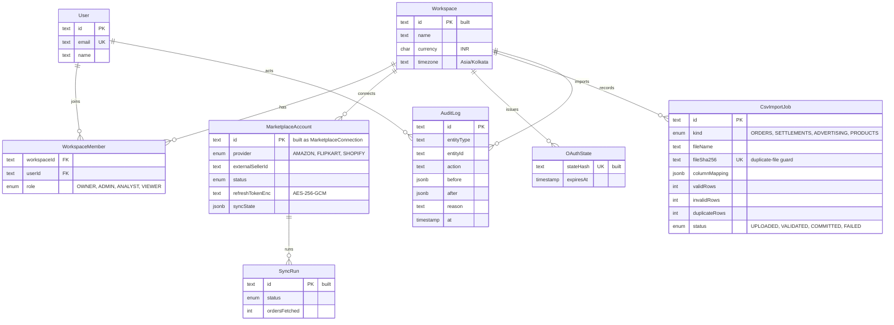
```mermaid
erDiagram
    User ||--o{ WorkspaceMember : "joins"
    Workspace ||--o{ WorkspaceMember : "has"
    Workspace ||--o{ MarketplaceAccount : "connects"
    MarketplaceAccount ||--o{ SyncRun : "runs"
    Workspace ||--o{ OAuthState : "issues"
    Workspace ||--o{ CsvImportJob : "imports"
    Workspace ||--o{ AuditLog : "records"
    User ||--o{ AuditLog : "acts"

    User {
        text id PK
        text email UK
        text name
    }
    Workspace {
        text id PK "built"
        text name
        char currency "INR"
        text timezone "Asia/Kolkata"
    }
    WorkspaceMember {
        text workspaceId FK
        text userId FK
        enum role "OWNER, ADMIN, ANALYST, VIEWER"
    }
    MarketplaceAccount {
        text id PK "built as MarketplaceConnection"
        enum provider "AMAZON, FLIPKART, SHOPIFY"
        text externalSellerId
        enum status
        text refreshTokenEnc "AES-256-GCM"
        jsonb syncState
    }
    OAuthState {
        text stateHash UK "built"
        timestamp expiresAt
    }
    SyncRun {
        text id PK "built"
        enum status
        int ordersFetched
    }
    CsvImportJob {
        text id PK
        enum kind "ORDERS, SETTLEMENTS, ADVERTISING, PRODUCTS"
        text fileName
        text fileSha256 UK "duplicate-file guard"
        jsonb columnMapping
        int validRows
        int invalidRows
        int duplicateRows
        enum status "UPLOADED, VALIDATED, COMMITTED, FAILED"
    }
    AuditLog {
        text id PK
        text entityType
        text entityId
        text action
        jsonb before
        jsonb after
        text reason
        timestamp at
    }
```

### B. Catalog, inventory and orders



Diagram source (Mermaid): edit here, then run <code>npm run docs:diagrams</code>

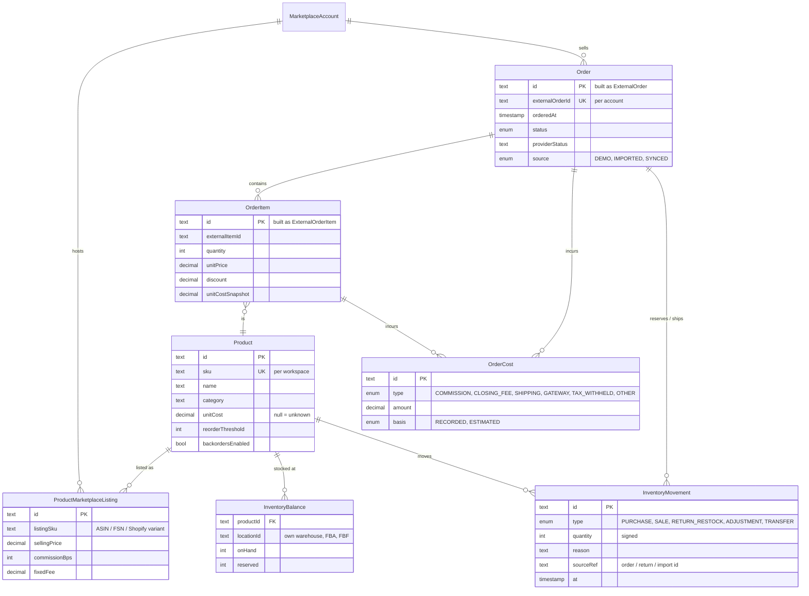
```mermaid
erDiagram
    Product ||--o{ ProductMarketplaceListing : "listed as"
    Product ||--o{ InventoryBalance : "stocked at"
    Product ||--o{ InventoryMovement : "moves"
    MarketplaceAccount ||--o{ ProductMarketplaceListing : "hosts"
    MarketplaceAccount ||--o{ Order : "sells"
    Order ||--o{ OrderItem : "contains"
    Order ||--o{ OrderCost : "incurs"
    OrderItem }o--|| Product : "is"
    OrderItem ||--o{ OrderCost : "incurs"
    Order ||--o{ InventoryMovement : "reserves / ships"

    Product {
        text id PK
        text sku UK "per workspace"
        text name
        text category
        decimal unitCost "null = unknown"
        int reorderThreshold
        bool backordersEnabled
    }
    ProductMarketplaceListing {
        text id PK
        text listingSku "ASIN / FSN / Shopify variant"
        decimal sellingPrice
        int commissionBps
        decimal fixedFee
    }
    InventoryBalance {
        text productId FK
        text locationId "own warehouse, FBA, FBF"
        int onHand
        int reserved
    }
    InventoryMovement {
        text id PK
        enum type "PURCHASE, SALE, RETURN_RESTOCK, ADJUSTMENT, TRANSFER"
        int quantity "signed"
        text reason
        text sourceRef "order / return / import id"
        timestamp at
    }
    Order {
        text id PK "built as ExternalOrder"
        text externalOrderId UK "per account"
        timestamp orderedAt
        enum status
        text providerStatus
        enum source "DEMO, IMPORTED, SYNCED"
    }
    OrderItem {
        text id PK "built as ExternalOrderItem"
        text externalItemId
        int quantity
        decimal unitPrice
        decimal discount
        decimal unitCostSnapshot
    }
    OrderCost {
        text id PK
        enum type "COMMISSION, CLOSING_FEE, SHIPPING, GATEWAY, TAX_WITHHELD, OTHER"
        decimal amount
        enum basis "RECORDED, ESTIMATED"
    }
```

### C. Money movements, returns, advertising, expenses and insights



Diagram source (Mermaid): edit here, then run <code>npm run docs:diagrams</code>

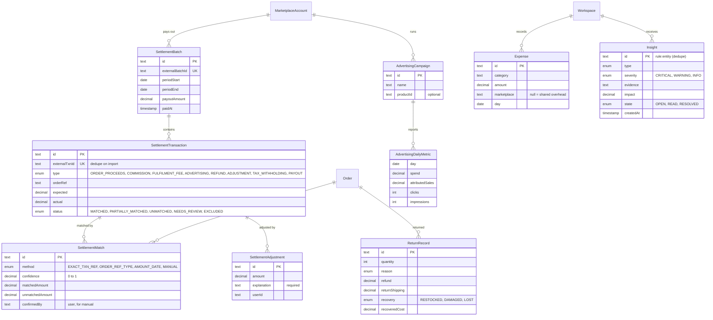
```mermaid
erDiagram
    MarketplaceAccount ||--o{ SettlementBatch : "pays out"
    SettlementBatch ||--o{ SettlementTransaction : "contains"
    SettlementTransaction ||--o{ SettlementMatch : "matched by"
    Order ||--o{ SettlementMatch : "explains"
    SettlementTransaction ||--o{ SettlementAdjustment : "adjusted by"
    Order ||--o{ ReturnRecord : "returned"
    MarketplaceAccount ||--o{ AdvertisingCampaign : "runs"
    AdvertisingCampaign ||--o{ AdvertisingDailyMetric : "reports"
    Workspace ||--o{ Expense : "records"
    Workspace ||--o{ Insight : "receives"

    SettlementBatch {
        text id PK
        text externalBatchId UK
        date periodStart
        date periodEnd
        decimal payoutAmount
        timestamp paidAt
    }
    SettlementTransaction {
        text id PK
        text externalTxnId UK "dedupe on import"
        enum type "ORDER_PROCEEDS, COMMISSION, FULFILMENT_FEE, ADVERTISING, REFUND, ADJUSTMENT, TAX_WITHHOLDING, PAYOUT"
        text orderRef
        decimal expected
        decimal actual
        enum status "MATCHED, PARTIALLY_MATCHED, UNMATCHED, NEEDS_REVIEW, EXCLUDED"
    }
    SettlementMatch {
        text id PK
        enum method "EXACT_TXN_REF, ORDER_REF_TYPE, AMOUNT_DATE, MANUAL"
        decimal confidence "0 to 1"
        decimal matchedAmount
        decimal unmatchedAmount
        text confirmedBy "user, for manual"
    }
    SettlementAdjustment {
        text id PK
        decimal amount
        text explanation "required"
        text userId
    }
    ReturnRecord {
        text id PK
        int quantity
        enum reason
        decimal refund
        decimal returnShipping
        enum recovery "RESTOCKED, DAMAGED, LOST"
        decimal recoveredCost
    }
    AdvertisingCampaign {
        text id PK
        text name
        text productId "optional"
    }
    AdvertisingDailyMetric {
        date day
        decimal spend
        decimal attributedSales
        int clicks
        int impressions
    }
    Expense {
        text id PK
        text category
        decimal amount
        text marketplace "null = shared overhead"
        date day
    }
    Insight {
        text id PK "rule:entity (dedupe)"
        enum type
        enum severity "CRITICAL, WARNING, INFO"
        text evidence
        decimal impact
        enum state "OPEN, READ, RESOLVED"
        timestamp createdAt
    }
```

**Built today:** `Workspace`, `MarketplaceConnection` (→ MarketplaceAccount), `OAuthState`, `SyncRun`, `ExternalOrder` (→ Order), `ExternalOrderItem` (→ OrderItem). Everything else is 🔜. The analytics demo uses equivalent **in-memory** shapes (`src/data/demo/types.ts`).

---

## 10.4 Data ingestion: three ways data gets in



Diagram source (Mermaid): edit here, then run <code>npm run docs:diagrams</code>

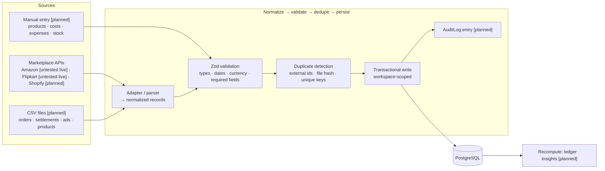
```mermaid
flowchart LR
    subgraph sources["Sources"]
        api["Marketplace APIs<br/>Amazon [untested live] · Flipkart [untested live] · Shopify [planned]"]
        csv["CSV files [planned]<br/>orders · settlements · ads · products"]
        manual["Manual entry [planned]<br/>products · costs · expenses · stock"]
    end

    subgraph pipeline["Normalize → validate → dedupe → persist"]
        norm["Adapter / parser<br/>→ normalized records"]
        val["Zod validation<br/>types · dates · currency · required fields"]
        dedupe["Duplicate detection<br/>external ids · file hash · unique keys"]
        tx["Transactional write<br/>workspace-scoped"]
        audit["AuditLog entry [planned]"]
    end

    db[("PostgreSQL")]
    recompute["Recompute: ledger · insights [planned]"]

    api --> norm
    csv --> norm
    manual --> val
    norm --> val --> dedupe --> tx --> db
    tx --> audit
    db --> recompute
```

### CSV import flow (spec §9 / §18) 🔜



Diagram source (Mermaid): edit here, then run <code>npm run docs:diagrams</code>

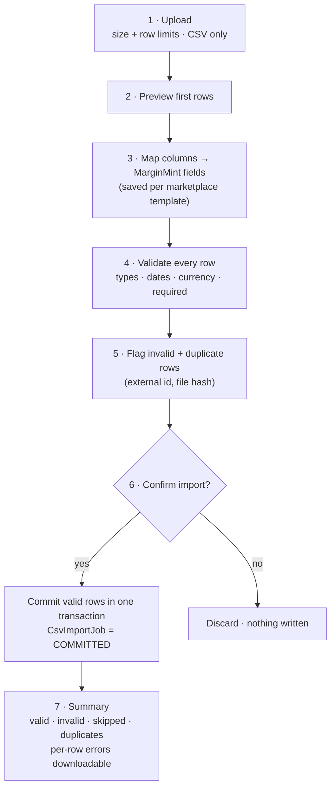
```mermaid
flowchart TB
    up["1 · Upload<br/>size + row limits · CSV only"] --> prev["2 · Preview first rows"]
    prev --> map["3 · Map columns → MarginMint fields<br/>(saved per marketplace template)"]
    map --> val["4 · Validate every row<br/>types · dates · currency · required"]
    val --> dup["5 · Flag invalid + duplicate rows<br/>(external id, file hash)"]
    dup --> confirm{"6 · Confirm import?"}
    confirm -- "yes" --> commit["Commit valid rows in one transaction<br/>CsvImportJob = COMMITTED"]
    confirm -- "no" --> cancel["Discard · nothing written"]
    commit --> summary["7 · Summary<br/>valid · invalid · skipped · duplicates<br/>per-row errors downloadable"]
```

---

## 10.5 Order-to-cash lifecycle

How one sale flows through every context, and where each number on the dashboard comes from.



Diagram source (Mermaid): edit here, then run <code>npm run docs:diagrams</code>

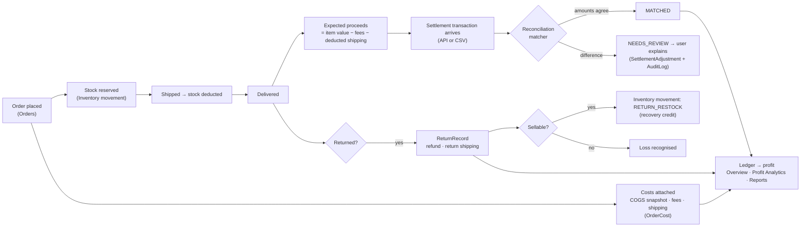
```mermaid
flowchart LR
    o["Order placed<br/>(Orders)"] --> res["Stock reserved<br/>(Inventory movement)"]
    o --> cost["Costs attached<br/>COGS snapshot · fees · shipping<br/>(OrderCost)"]
    res --> ship["Shipped → stock deducted"]
    ship --> del["Delivered"]
    del --> exp["Expected proceeds<br/>= item value − fees − deducted shipping"]
    exp --> stl["Settlement transaction arrives<br/>(API or CSV)"]
    stl --> match{"Reconciliation<br/>matcher"}
    match -- "amounts agree" --> ok["MATCHED"]
    match -- "difference" --> rev["NEEDS_REVIEW → user explains<br/>(SettlementAdjustment + AuditLog)"]
    del --> ret{"Returned?"}
    ret -- "yes" --> rr["ReturnRecord<br/>refund · return shipping"]
    rr --> restock{"Sellable?"}
    restock -- "yes" --> mv["Inventory movement: RETURN_RESTOCK<br/>(recovery credit)"]
    restock -- "no" --> lost["Loss recognised"]
    cost & rr & ok --> ledger["Ledger → profit<br/>Overview · Profit Analytics · Reports"]
```

---

## 10.6 Settlement reconciliation engine 🔜

Implements the matching priority from spec §9. **Nothing ambiguous is ever auto-reconciled.**



Diagram source (Mermaid): edit here, then run <code>npm run docs:diagrams</code>

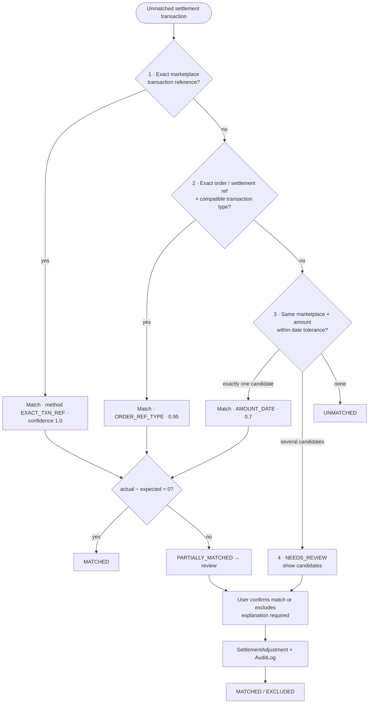
```mermaid
flowchart TB
    t(["Unmatched settlement transaction"]) --> m1{"1 · Exact marketplace<br/>transaction reference?"}
    m1 -- "yes" --> a1["Match · method EXACT_TXN_REF · confidence 1.0"]
    m1 -- "no" --> m2{"2 · Exact order / settlement ref<br/>+ compatible transaction type?"}
    m2 -- "yes" --> a2["Match · ORDER_REF_TYPE · 0.95"]
    m2 -- "no" --> m3{"3 · Same marketplace + amount<br/>within date tolerance?"}
    m3 -- "exactly one candidate" --> a3["Match · AMOUNT_DATE · 0.7"]
    m3 -- "several candidates" --> rv["4 · NEEDS_REVIEW<br/>show candidates"]
    m3 -- "none" --> um["UNMATCHED"]
    a1 & a2 & a3 --> diff{"actual − expected = 0?"}
    diff -- "yes" --> mt["MATCHED"]
    diff -- "no" --> pm["PARTIALLY_MATCHED → review"]
    rv --> user["User confirms match or excludes<br/>explanation required"]
    pm --> user
    user --> adj["SettlementAdjustment + AuditLog"]
    adj --> done["MATCHED / EXCLUDED"]
```

Supports **one-to-many** (one payout covers many orders) and **many-to-one** (many fees for one order) via multiple `SettlementMatch` rows per transaction. Sign convention: difference = actual − expected (negative = underpaid).

---

## 10.7 Profit computation on real data

Today the ledger reads the in-memory demo. In the full product it reads the database; **the domain formulas and pages do not change**.



Diagram source (Mermaid): edit here, then run <code>npm run docs:diagrams</code>

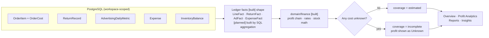
```mermaid
flowchart LR
    subgraph db["PostgreSQL (workspace-scoped)"]
        oi["OrderItem + OrderCost"]
        rr["ReturnRecord"]
        adm["AdvertisingDailyMetric"]
        ex["Expense"]
        inv["InventoryBalance"]
    end
    facts["Ledger facts [built] shape<br/>LineFact · ReturnFact · AdFact · ExpenseFact<br/> [planned] built by SQL aggregation"]
    dom["domain/finance [built]<br/>profit chain · rates · stock math"]
    cov{"Any cost unknown?"}
    est["coverage = estimated"]
    inc["coverage = incomplete<br/>profit shown as Unknown"]
    out["Overview · Profit Analytics<br/>Reports · Insights"]
    db --> facts --> dom --> cov
    cov -- "no" --> est --> out
    cov -- "yes" --> inc --> out
```

**Scale plan:** aggregate in SQL (sum per day / product / channel) instead of loading every row, and cache per `(workspace, range, marketplace)`. Invalidate the cache when a sync or import commits.

---

## 10.8 Insight engine lifecycle



Diagram source (Mermaid): edit here, then run <code>npm run docs:diagrams</code>

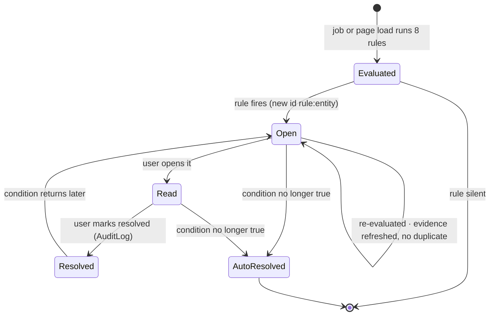
```mermaid
stateDiagram-v2
    [*] --> Evaluated: job or page load runs 8 rules
    Evaluated --> Open: rule fires (new id rule:entity)
    Evaluated --> [*]: rule silent
    Open --> Open: re-evaluated · evidence refreshed, no duplicate
    Open --> Read: user opens it
    Read --> Resolved: user marks resolved (AuditLog)
    Open --> AutoResolved: condition no longer true
    Read --> AutoResolved: condition no longer true
    Resolved --> Open: condition returns later
    AutoResolved --> [*]
```

| # | Spec insight | Status |
|---|--------------|--------|
| 1 | Negative-profit product (after ads) | ✅ |
| 2 | High-revenue, low-margin product | ✅ |
| 3 | Inventory likely to run out | ✅ |
| 4 | Excessive return rate | ✅ |
| 5 | Settlement discrepancy | ✅ |
| 6 | Advertising efficiency decline | ✅ (as "ad spend outpacing sales") |
| 7 | Unusually high marketplace fees | 🔜 |
| 8 | Stock-out risk on a high-profit product | ✅ (raises severity to critical) |
| — | Persisted read / resolved state, creation time | 🔜 |
| — | LLM explanations (facts vs estimates labelled, cites records) | 🔜 optional, after rules |

---

## 10.9 Background jobs 🔜



Diagram source (Mermaid): edit here, then run <code>npm run docs:diagrams</code>

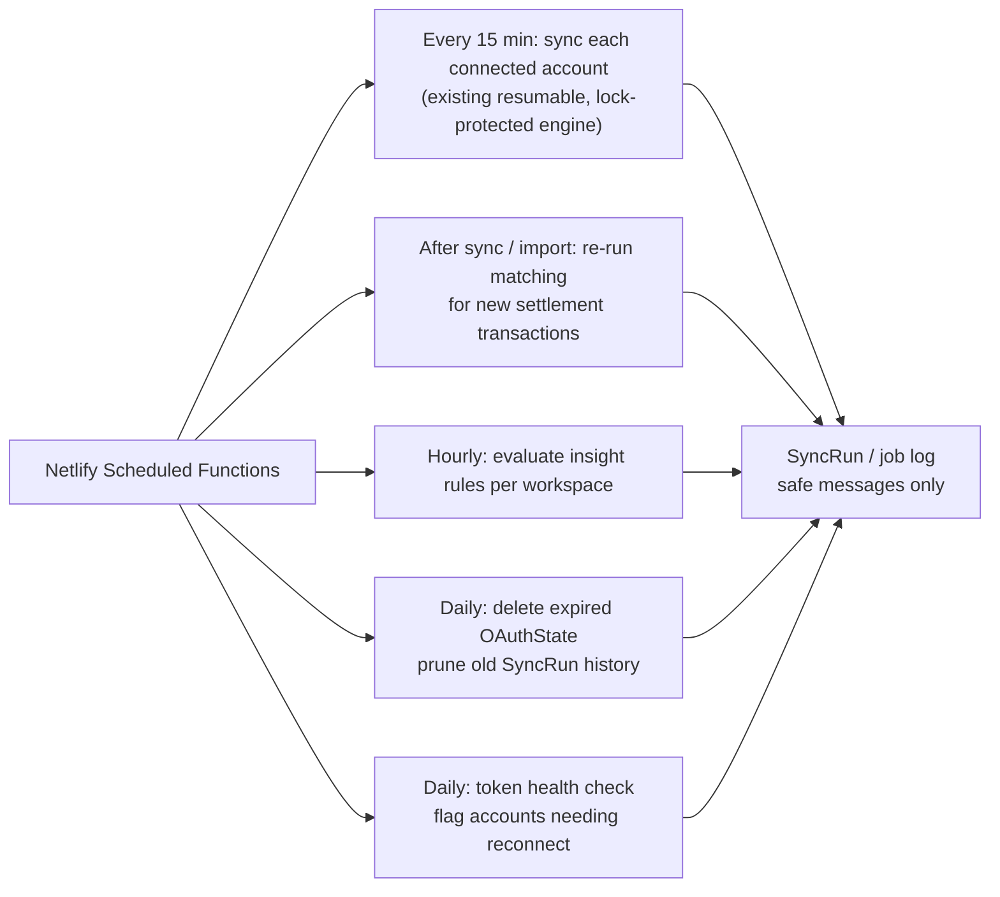
```mermaid
flowchart LR
    cron["Netlify Scheduled Functions"] --> j1["Every 15 min: sync each connected account<br/>(existing resumable, lock-protected engine)"]
    cron --> j2["After sync / import: re-run matching<br/>for new settlement transactions"]
    cron --> j3["Hourly: evaluate insight rules per workspace"]
    cron --> j4["Daily: delete expired OAuthState<br/>prune old SyncRun history"]
    cron --> j5["Daily: token health check<br/>flag accounts needing reconnect"]
    j1 & j2 & j3 & j4 & j5 --> log["SyncRun / job log<br/>safe messages only"]
```

---

## 10.10 Authentication and tenancy

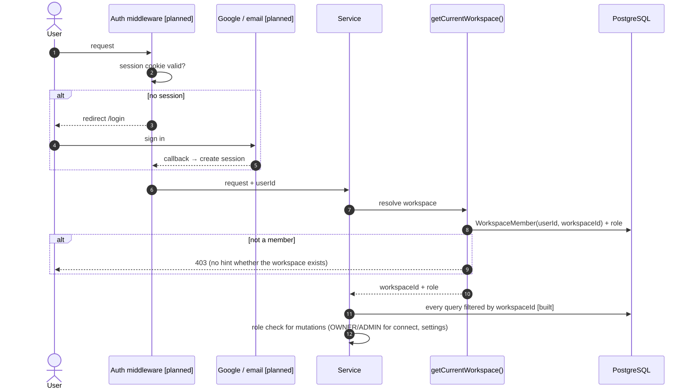

Diagram source (Mermaid): edit here, then run <code>npm run docs:diagrams</code>

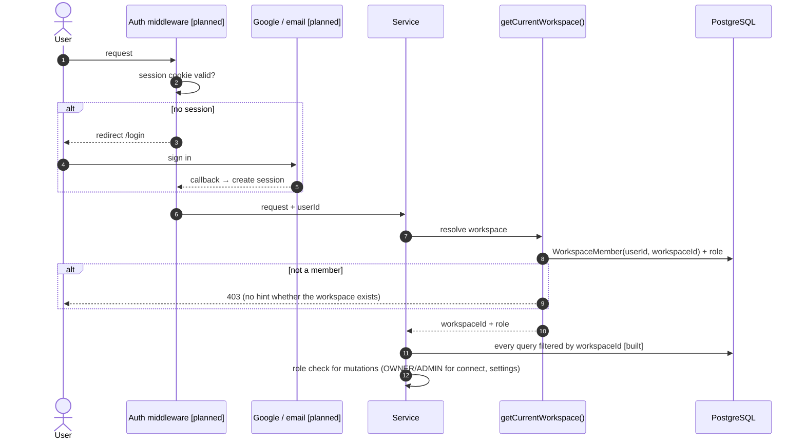
```mermaid
sequenceDiagram
    autonumber
    actor U as User
    participant MW as Auth middleware [planned]
    participant IDP as Google / email [planned]
    participant SVC as Service
    participant WS as getCurrentWorkspace()
    participant DB as PostgreSQL

    U->>MW: request
    MW->>MW: session cookie valid?
    alt no session
        MW-->>U: redirect /login
        U->>IDP: sign in
        IDP-->>MW: callback → create session
    end
    MW->>SVC: request + userId
    SVC->>WS: resolve workspace
    WS->>DB: WorkspaceMember(userId, workspaceId) + role
    alt not a member
        WS-->>U: 403 (no hint whether the workspace exists)
    end
    WS-->>SVC: workspaceId + role
    SVC->>DB: every query filtered by workspaceId [built]
    SVC->>SVC: role check for mutations (OWNER/ADMIN for connect, settings)
```

| Role | View analytics | Edit products/stock | Review settlements | Connect marketplaces / settings |
|------|:-:|:-:|:-:|:-:|
| Owner | ✅ | ✅ | ✅ | ✅ |
| Admin | ✅ | ✅ | ✅ | ✅ |
| Analyst | ✅ | ✅ | ✅ | — |
| Viewer | ✅ | — | — | — |

*(Roles are a proposal; the spec requires workspace membership checks but does not define roles.)*

---

## 10.11 Deployment and environments



Diagram source (Mermaid): edit here, then run <code>npm run docs:diagrams</code>

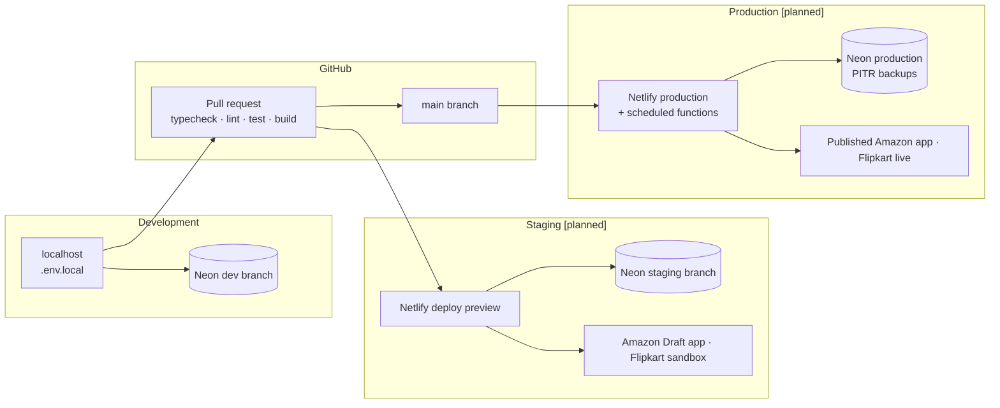
```mermaid
flowchart LR
    subgraph dev["Development"]
        local["localhost<br/>.env.local"]
        neonDev[("Neon dev branch")]
        local --> neonDev
    end
    subgraph ci["GitHub"]
        pr["Pull request<br/>typecheck · lint · test · build"]
        main["main branch"]
        pr --> main
    end
    subgraph staging["Staging [planned]"]
        nstg["Netlify deploy preview"]
        neonStg[("Neon staging branch")]
        sbx["Amazon Draft app · Flipkart sandbox"]
        nstg --> neonStg
        nstg --> sbx
    end
    subgraph prod["Production [planned]"]
        nprod["Netlify production<br/>+ scheduled functions"]
        neonProd[("Neon production<br/>PITR backups")]
        live["Published Amazon app · Flipkart live"]
        nprod --> neonProd
        nprod --> live
    end
    local --> pr
    pr --> nstg
    main --> nprod
```

| Concern | Plan |
|---------|------|
| Secrets | Per-environment env vars in Netlify; separate marketplace apps and `TOKEN_ENCRYPTION_KEY` per environment |
| Migrations | `prisma migrate deploy` in the release step, using the direct (non-pooled) URL |
| Backups | Neon point-in-time restore on production; documented retention |
| Monitoring | Error tracking + structured logs without tokens or PII; alert on repeated sync failures |
| Region | Put Neon and Netlify functions in the same region (round-trip latency drives sync speed) |

---

## 10.12 Cross-cutting rules (apply to every context)

| Concern | Rule | Status |
|---------|------|--------|
| Money | Integer paise + `decimal.js`; unknown ≠ 0; settlements ≠ sales | ✅ |
| Tenancy | Every query scoped by a server-derived `workspaceId` | ✅ queries · 🔜 login |
| Validation | Zod at every boundary: URL params, forms, CSV rows, provider responses, env | ✅ (CSV/forms 🔜) |
| Idempotency | External ids + unique keys on every import and sync | ✅ sync · 🔜 CSV |
| Transactions | Multi-row financial / stock changes in one transaction | ✅ sync · 🔜 others |
| Audit | Before/after + actor + reason for financial and stock edits | 🔜 |
| Secrets | Server-only; tokens AES-256-GCM; never logged | ✅ |
| Export safety | CSV formula-injection escaping | ✅ |
| Data minimisation | No buyer PII from marketplaces | ✅ |
| Honesty in UI | Demo / imported / synced always labelled; estimates labelled; no fake buttons | ✅ |

---

## 10.13 Build status by spec phase



Diagram source (Mermaid): edit here, then run <code>npm run docs:diagrams</code>

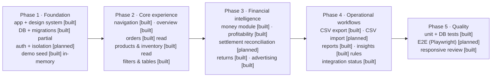
```mermaid
flowchart LR
    p1["Phase 1 · Foundation<br/>app + design system [built]<br/>DB + migrations [built] partial<br/>auth + isolation [planned]<br/>demo seed [built] in-memory"]
    p2["Phase 2 · Core experience<br/>navigation [built] · overview [built]<br/>orders [built] read<br/>products & inventory [built] read<br/>filters & tables [built]"]
    p3["Phase 3 · Financial intelligence<br/>money module [built] · profitability [built]<br/>settlement reconciliation [planned]<br/>returns [built] · advertising [built]"]
    p4["Phase 4 · Operational workflows<br/>CSV export [built] · CSV import [planned]<br/>reports [built] · insights [built] rules<br/>integration status [built]"]
    p5["Phase 5 · Quality<br/>unit + DB tests [built]<br/>E2E (Playwright) [planned]<br/>responsive review [built]"]
    p1 --> p2 --> p3 --> p4 --> p5
```

**Biggest gaps to reach the full product, in order:** authentication & tenancy → live marketplace verification → persistence of catalog/costs/settlements → ledger on the database → reconciliation engine + review workflow → CSV import → audit log → scheduled jobs → Shopify. Details in [Known gaps & roadmap](../12-known-gaps-and-roadmap.md).
